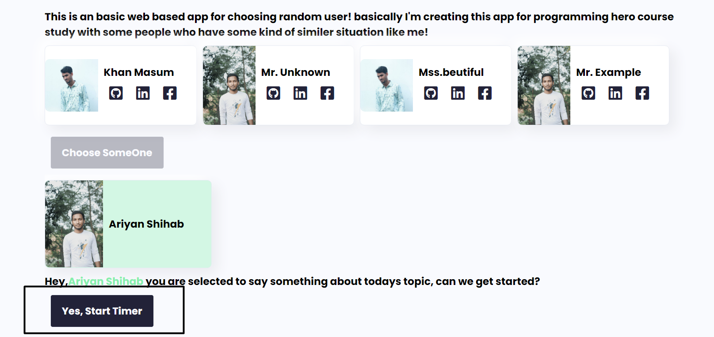
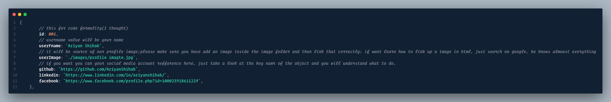

# creating readme file for random user project

# Random User Picker

Click on the button called **Choose Some One to choose a random user from the dom.**

after that, click the start timer button when you are ready to start the countdown

### I want to develop in a dynamic way, that’s why I’m storing all the user data in a different file called data.js (script/data.js). if you want to add yourself to this app, just edit that data.js file (will described in the comment of the code file;

